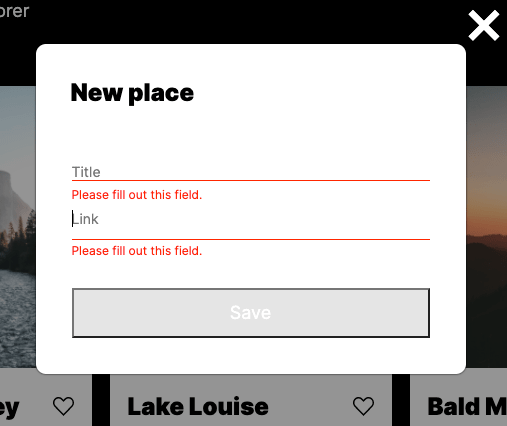

# Around The U.S.
## Practicum - Web Development Program | Project 10

### **Overview**

This is a single page site which contains interactive features like updating user information, avatar and adding graphical images as cards. The page uses React and an API to pull & update data.

### Technologies/Languages Used
* Figma
* Terminal/Command line
* HTML
* CSS
* Responsive design
* BEM class naming conventions
* BEM file structure organization
* CSS Flexbox property
* CSS Grid property 
* CSS Transition property
* JavaScript Modal/Form popup-display
* JavaScript Modal/Form input focus
* JavaScript Form Validation
* JavaScript Close w/ esc key + overlay click
* JavaScript Image Card Creator/event listener setup
* JavaSrcript Image Card remover button
* Classes
* Class Destructuring
* Import Modules
* Webpack
* React

### How to run
Download the repo to your local machine. Once installed run ```npm start``` from the root folder of the project within your *terminal* or *shell*. It will automatically open within your default browser.

### Sample Images





